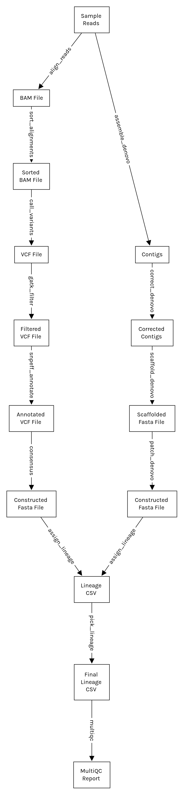

# Sars-CoV-2 Lineage Identification Workflow

A Snakemake workflow for identifying a Sars-CoV-2 lineage from a paired-end
read. It implements both de-novo and reference-guided genome assembly, and uses
Pangolin to identify the Covid lineage.

This project was built by group 3 for the DataScience in Bioinformatics WiSe
2022/23 course.

## System Requirements

- Operating System: Recent version of Linux, Ubuntu 20.04 or newer is recommended
- Memory: At least 8GB
- CPU: At least 2 cores are recommended
- Storage: At least 10 GB of free space

Requirements can vary depending on the sample sizes and number of samples.

## Installation

You can either run the program directly using Snakemake, or you can use a
Docker image which has all of the software and libraries already installed.

### Using Snakemake

#### Step 1: Install Mambaforge and Snakemake

With Python installed, follow the instructions found on the official [Snakemake
Installation
guide](https://snakemake.readthedocs.io/en/stable/getting_started/installation.html)
to install Mambaforge and Snakemake.

Make sure to do a full installation, creating an environment named `snakemake`:

```
$ conda activate base
$ mamba create -c conda-forge -c bioconda -n snakemake snakemake
```

#### Step 2: Clone The Repository

Run the following command to clone the repository from GitHub:

```
$ git clone https://github.com/shahab-ab/project-g3.git
```

Or download the latest release and extract it on your machine.

### Using Docker

#### Step 1: Install Docker

From the [Get Docker page](https://docs.docker.com/get-docker/), install the
appropriate Docker version for your system.

#### Step 2: Pull Docker Image

Run the following command to pull the latest image of the workflow from Docker
Hub:

```
$ docker pull docksh360/project-g3:latest
```

## Input

Copy the samples whose lineage you want to identify to `data/samples` (if you
have not cloned the repository, create the directory `data/samples` yourself).
Each sample must consist of a paired-end read. Sample files must be named as
follows:

```
<SAMPLE_NAME><READ1_SUFFIX>.fastq.gz # First read
<SAMPLE_NAME><READ2_SUFFIX>.fastq.gz # Second read
```

Here is an example of a paired-end read of a sample named `my_sample`:

```
$ ls data/samples
my_sample.1.fastq.gz  my_sample.2.fastq.gz
```

Then edit `config/config.yaml` (if you have not cloned the repository, create
`config/config.yaml` yourself) and change the `samples` object to reflect the
names of the samples. The `samples` object contains one sub-object for each
sample, whose key is the `<SAMPLE_NAME>` mentioned above, and which has two
properties:

- `r1_suffix`: The suffix for the first read (`<READ1_SUFFIX`), without the `.fastq.gz` extension
- `r2_suffix`: The suffix for the second read (`<READ2_SUFFIX`), without the `.fastq.gz` extension

Here is a full example of `config/config.yaml`, which refers to two paired-end
sample reads named `my_sample.1.fastq.gz` and `my_sample.2.fastq.gz` (in this
case, `my_sample` is the `<SAMPLE_NAME>` and `.1` and `.2` are `<READ1_SUFFIX>`
and `<READ2_SUFFIX>` respectively:

```
samples:
    "my_sample":
      r1_suffix: ".1"
      r2_suffix: ".2"
```

## Running

### With Snakemake

From the project's main directory, run the following commands:

```
$ conda activate snakemake # activate the snakemake environment if necessary
$ snakemake --use-conda --cores 4 report/qc/multiqc.html
```

You may change the number of cores (4 in this instance) to reflect how many
cores you would like the workflow to make use of.

### With Docker

From the project's main directory, run the following command:

```
$ docker run --rm \
	--volume="`pwd`/data/samples:/project/data/samples:ro" \
	--volume="`pwd`/config:/project/config:ro" \
	--volume="`pwd`/report/qc:/project/report/qc" \
	docksh360/project-g3:latest
```

Explanation: This command creates a temporary container using the
`docksh360/project-g3:latest` image, mounts the required input and output
directories as volumes, and runs the command to generate the final output.

## Output

After successfully running the workflow, all of the results can be found in
`report/qc/multiqc.html`. The most relevant section would be the Pangolin
section, which shows a table containing entries named as follows:

- `<SAMPLE_NAME>`: The final result, obtained by selecting the better result between de-novo and reference-guided assembly
- `[denovo] <SAMPLE_NAME>`: The result obtained using de-novo assembly
- `[refbased] <SAMPLE_NAME>`: The result obtained using reference-guided assembly

This is an example output of running the workflow on 4 different samples:


In this example, `RV417026_S15_L001` is identified assigned different lineages
by de-novo and reference-guided assembly. However, we notice that conflict for
the reference-guided result has a value of 0.1, whereas with de-novo, conflict
is 0. In this case, we picked the result with the lower conflict value.

## File Structure and Organization

The project has the following directory structure:

- `config/config.yaml`: Used to specify the names of the samples.
- `data/genomes/genome.fa`: The reference Sars-CoV-2 genome, NC_045512.2.
- `data/samples/`: Should contain the samples on which to run the workflow.
- `workflow/envs/`: Contains the Conda environments which are used by some of the tools in the workflow.
- `workflow/rules/`: Contains all of the rules for the workflow. All files directly under this directory are shared by both de-novo and reference-guided assignment.
- `workflow/rules/de_novo/`: Contains all of the rules that are specific to de-novo assembly.
- `workflow/rules/reference_guided/`: Contains all of the rules that are specific to reference-guided assembly.
- `workflow/scripts/`: Contains the scripts that are used in the workflow.

Additionally, the following directories are created upon running the workflow:

- `logs/`: Contains the output logs for all the rules.
- `report/`: Contains the final MultiQC report, along with reports from other tools.
- `results/`: Contains all of the intermediate files used by the rules.

## Workflow

This following flowchart shows the main steps involved in this workflow. Please
note that some steps are omitted for brevity. For the full list of steps, you
can either generate a Snakemake report by running the command `snakemake
--report report.html`, or read the source code.



## Attribution

- Jean Qussa
- Shahab Abbaszadeh
- Yulin Luo

## Resources

These are some of the resources that were directly or indirectly used in the
creation of this workflow:

- https://www.ncbi.nlm.nih.gov/sra/docs/sars-cov-2-illumina-variant-calling-pipeline/
- https://www.ncbi.nlm.nih.gov/pmc/articles/PMC9013232/
- https://journals.plos.org/plosone/article?id=10.1371/journal.pone.0262953
- https://github.com/dridk/Sars-CoV-2-NGS-pipeline
- https://github.com/charlesfoster/covid-illumina-snakemake
- https://www.ridom.de/u/SARS-CoV-2_Analysis_Quick_Start.html
